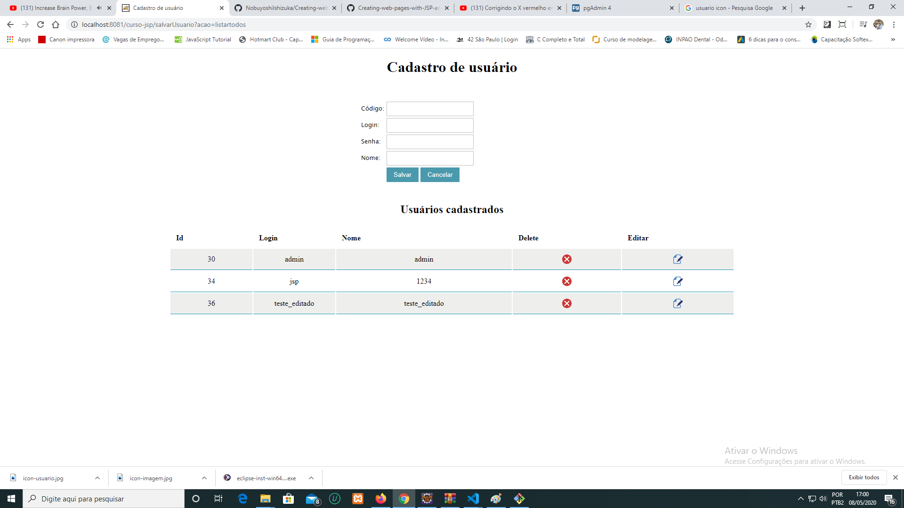

# Sistema de Cadastro e Edição de Usuários

## Projeto em construção ##
 
 O projeto está sendo elaborado no curso de Java-Web do professor Alex Egidio do JDev terinamentos. 

 Neste projeto utilizando o JSP, Servlets e o banco de dados Postgresql, estou criando um sistema de cadastro de usuarios no banco de dados.

 Para acessar o sistema o usuario deverá efetuar o login na tela inicial.

 ## Página de Login ##

 

 Caso o usuário seja cadastrado no banco de dados, o navegador abrirá a página de boas vindas, nesta página foi inserido um link para redirecionar o usuário para a página de cadastro de usuários.

## Página de Boas-Vindas ##
 

 Após o usuário clicar no link da página de boas-vindas o usuário será redirecionado para a página de cadastro de novos usuários. Nesta página ele poderá inserir novos usuários no banco de dados. Logo abaixo do formulário de cadastro foi inserido uma tabela que mostrará todos os usuários cadastrados no banco de dados contendo botões para excluir e deletar os usuários cadastrados.

## Página de Cadastro de Usuários ##
 

